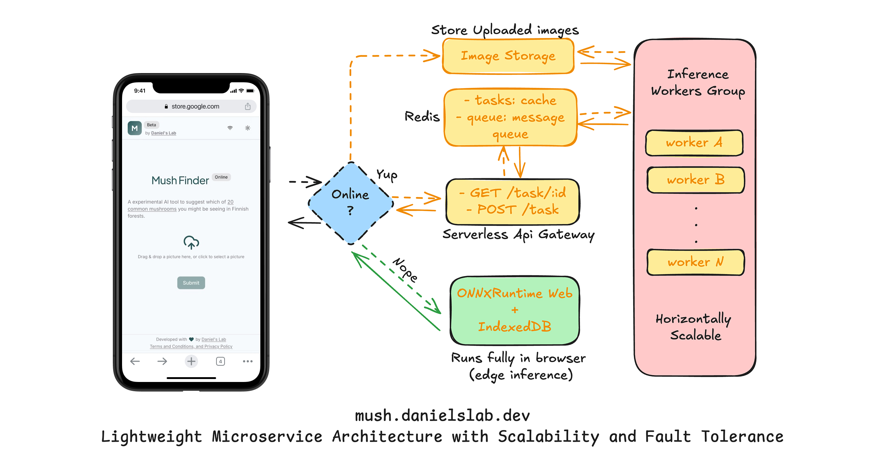

# MushFinder - Experimental AI for Identifying 20 Common Finnish Forest Mushrooms

**Don’t expect too much from the results!**
- Mushrooms are confusing by nature, and sometimes it’s difficult to identify them from just a picture.  
- It’s also tricky for users to take a clear photo in the wild. Mushrooms are usually small and hidden in the grass, and once you pick them up for a photo, they may already look different from the images in my training set 😄

But I still wanted to put it out there as my very first machine learning project. 
And honestly, with a decent photo it can perform quite well. 
The deployment itself was also intesting I guess, so I thought it would be fun to share.

Mushroom picking is a popular activity in Finland. However, for many foreigners like me, identifying the right mushrooms in the forest can be confusing.

MushFinder is an experimental tool I built to help users get a rough suggestion of what kind of mushroom they're seeing (not to determine if it's edible), based on a photo taken with their phone. It's powered by a custom CNN model and focuses specifically on mushrooms commonly found in Finnish forests.

Try it for fun: [https://mush.danielslab.dev](https://mush.danielslab.dev)

---

## ✨ Challenges, Solutions, and Remaining Issues

### 🧠 Machine Learning
- **Class selection**  
At the beginning, I ambitiously tried to train the model on nearly **200 mushroom species**. Unsurprisingly, the accuracy was poor and the model struggled to generalize. I then narrowed it down to **20 of the most common mushrooms in Finnish forests**, which drastically improved both training stability and accuracy.  
- **Model architecture**  
I experimented with different architectures and finally settled on the **Facebook ConvNeXt series**, applied through **transfer learning in PyTorch**. This gave me a good balance between accuracy and model size.  
- **Hyperparameter tuning**  
Initially I tuned everything manually, which was slow and tedious. Later I switched to **Optuna** for automated hyperparameter search, which helped speed up experiments and gave more consistent results.  
- **Loss function design**  
At one point I introduced a “toxic / edible” label as an auxiliary target. Interestingly, I found that using it only in the forward pass (without backpropagating the loss) worked better in practice.  
- **Real-world lesson**  
I learned that accuracy alone is not enough. In deployment, a top-1 prediction with very low confidence is practically useless. Many real photos failed to meet a “trustworthy” threshold, which was an important takeaway for me.

### 🗂️ Project Management
- This was my first time setting up a **monorepo with Turborepo**, and I really enjoyed it.  
- The monorepo includes:
  - a **frontend** (React + Progressive Web App(PWA)),  
  - an **API gateway** (TypeScript, running on Cloudflare Workers as Serverless functions), and  
  - a **Python inference workers** (running on Hugging Face Spaces).  
- Shared code was also interesting: I used **Zod** to define schemas, generated JSON Schema, and reused it across frontend (validation), API gateway, and Python backend (via Pydantic). This kept everything consistent and reduced bugs.

### 💻 Frontend
- I built MushFinder as a **Progressive Web App (PWA)** so that it can be installed like a native app and run offline.  
- On the client side, I integrated **ONNX-Runtime Web** to run inference directly in the browser. This means users can still get predictions even without internet access.  
- For offline persistence, I used **IndexedDB** to store both images and inference results, so users can revisit past identifications even when they’re offline.  
- The UI is optimized for **mobile-first usage**, since most people will be taking photos directly with their phones in the forest. Small touches like history tracking, disclaimer pop-ups, and a lightweight design help keep it simple and approachable.

### ⚙️ Backend
- The backend is structured as a **distributed inference system**:  
  - **API Gateway**: A lightweight service deployed on **Cloudflare Workers**, handling routing, validation, and coordination. Being serverless, it scales easily and requires minimal maintenance.  
  - **Task Queue / Cache**: I used **Upstash Redis** for distributed task management and caching. This makes it easier to handle concurrent requests and ensures results can be returned quickly.  
  - **Inference Worker**: The heavy lifting happens on **Hugging Face Spaces**, where the PyTorch model runs in a CPU container. This way I didn’t need to manage servers myself, and I could iterate faster.  
- Together, this architecture allowed me to combine **serverless scalability** with **flexibility for experimentation**. It’s not perfect (latency can still be high when the Hugging Face container spins up), but it was good enough to deploy a working prototype end-to-end.
